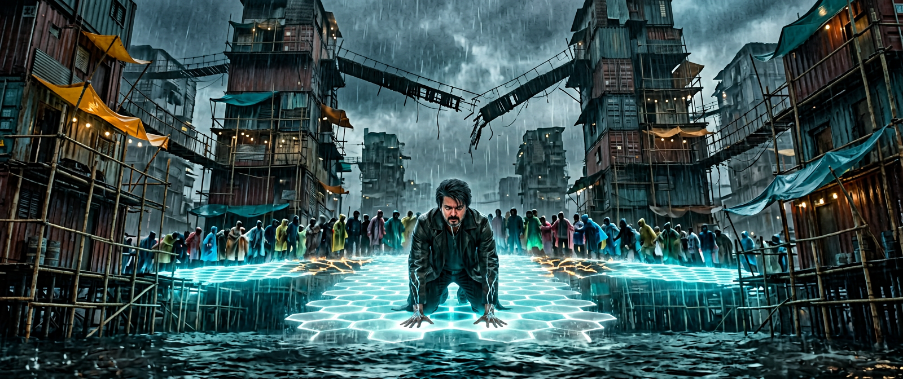

# THE LAST GUARDIAN
## Feature-film pre-production package — original IP

<p align="center">
  
</p>

> **Epic science-fiction superhero action thriller** · 2h 09m · 2.39:1 anamorphic · Dolby Atmos · PG-13 target
> **Original intellectual property.** No character, organisation, power system, artifact or storyline here derives from Marvel, DC, Star Wars or any other existing franchise.

**LOGLINE**
> Twelve years after a catastrophe erased a coastline and every super-powered Guardian but one, a memory-losing salvage diver must train the last child to inherit his power — and stop the mentor he thought he killed from erasing the grief of all humanity, one mind at a time.

---

## ▶ New here? [**START HERE — Document 00**](00-START-HERE.md)

The step-by-step: what to open, what to paste, in what order, and what to do with the clips that come out. Phase 0 setup → 120-generation animatic → scene-by-scene coverage → QC → edit → sound → export. Hinglish summary at the bottom of that page.

---

## The package

| # | Document | Contents |
|---|---|---|
| 00 | [**START HERE**](00-START-HERE.md) | **The step-by-step production workflow** — setup · animatic · coverage · QC · edit · sound · export |
| 01 | [Story Bible](01-story-bible.md) | Logline · complete story · three-act structure · thematic rules |
| 02 | [Character Bible](02-characters.md) | Main characters · relationships · backstories · powers · limitations · villain motivation |
| 03 | [World, Tech & Locations](03-world-tech-locations.md) | World-building · timeline · technology · 10 locked location sheets · usage matrix |
| 04 | [Costume & Visual Language](04-costume-and-visual-language.md) | Costume states for every character · colour palettes · lens & format language |
| 05a | [Screenplay, Scenes 1–15](05a-screenplay-scenes-01-15.md) | Scene objectives · action · dialogue (Act I / Act II-A) |
| 05b | [Screenplay, Scenes 16–30](05b-screenplay-scenes-16-30.md) | Scene objectives · action · dialogue (Act II-B / Act III) |
| 06 | [Master Shot List](06-shot-list.md) | **306 shots** — size, angle, lens, movement, lighting, environment, VFX, sound, duration *(generated)* |
| 07 | [VFX, Sound & Music](07-vfx-sound-music.md) | 8 hero effects · secondary effects register · sound design · music direction & themes |
| 08 | [Continuity Bible](08-continuity-bible.md) | Character continuity · location continuity · wound clocks · prop clocks · QC checklist |
| 09 | [Veo-Ready Video Prompts](09-veo-prompts.md) | **One continuity-locked prompt per shot, all 306** *(generated)* |
| 10 | [Image Prompts & Edit Plan](10-image-prompts-and-edit-plan.md) | Reference-still prompts · location plates · key art · post pipeline · the 10 cuts that matter |
| 11 | [**How to Generate the Film**](11-how-to-generate.md) | **Start here to actually make it** — Google Flow / Veo and Omni walkthrough, ingredient mapping, QC, the five things that will go wrong |
| 12 | [**Scene-by-Scene Prompt Sheets**](12-scene-by-scene-prompts.md) | **One sheet per scene, 30 sheets** — establishing still, hero still, whole-scene-in-one-clip, hero clip, full coverage *(generated)* |

### ▶ Scene-by-scene sheets — `prompts-scene/`
**The easiest way in.** One markdown sheet per scene (`prompts-scene/scene-01.md` … `scene-30.md`). Each sheet is self-contained and ordered the way you actually work: ① the establishing still prompt, ② the hero still prompt, ③ the whole scene as a single 8-second clip, ④ the hero shot at full quality, ⑤ every shot in cut order, clip-sized. Each sheet also lists exactly which approved reference images to attach. Index: [Document 12](12-scene-by-scene-prompts.md).

### ▶ Paste-ready prompt pack — `prompts-flow/`
**440 clips, each sized for one 8-second generation.** Open `prompts-flow/scene-01.txt`, copy a block, paste it into Google Flow. Shots longer than 8 seconds are pre-split into evenly sized parts with beat instructions (begin / continue / resolve) so the movement stays unbroken. `prompts-flow/shots.csv` is the same data as a spreadsheet for batch or API work. Full walkthrough in [Document 11](11-how-to-generate.md).

### Shooting boards
`boards/` holds approved keyframe plates — one per shot — used as first-frame conditioning for video generation. **Scene 1 is complete and locked** (10 of 306 plates); its plates `1D`, `1E` and `1J` are reused directly as Scene 15's `15B`, `15C` and `15D`, which is why it was generated first. See [boards/README.md](boards/README.md).

### Machine-readable data
| File | Contents |
|---|---|
| `data/shots-01-10.json` · `data/shots-11-20.json` · `data/shots-21-30.json` | The shot list as structured data — the single source of truth |
| `data/render-tracker.csv` | 440 rows, one per clip: `clip_id … still_used, status, take_file, qc_notes` — your progress sheet, everything starts at `TODO` |
| `data/veo-prompts.jsonl` | 306 rows: `shot_id`, `scene`, `act`, `location`, `duration_seconds`, `aspect_ratio`, `prompt`, `negative_prompt` — ready to feed a batch generation job |
| `tools/build-prompts.mjs` | Regenerates docs 06 and 09 plus the JSONL from the shot data |
| `tools/build-flow-pack.mjs` | Regenerates `prompts-flow/` — 440 clip-sized prompts + `shots.csv` |
| `tools/build-scene-prompts.mjs` | Regenerates `prompts-scene/` and Document 12 — 30 scene sheets |
| `tools/build-render-tracker.mjs` | Regenerates `data/render-tracker.csv` — 440-row TODO list for the generation phase |
| `tools/helmet-cam-degrade.sh` | Deterministic Scene 15 helmet-cam treatment: `tools/helmet-cam-degrade.sh SRC DST` |
| `tools/lib-prompt.mjs` | Shared character cards, location cards, style and negative lines used by both prompt packs |

### Reference stills
`reference/` contains approved character, costume, location and key-art references. **These are the ground truth for every generated shot** — condition on the image, never re-prompt from text.

**Cast**
| File | Subject |
|---|---|
| `char-01-arjun-vedh.png` | Arjun Vedh — salvage diver (state A2) |
| `char-02-kira-okonkwo.png` | Kira Okonkwo — kite runner (state K1) |
| `char-03-dev-aranya.png` | Dev Aranya / The Hollow — crystallisation stage 3 |
| `char-04-riya-sen.png` | Commander Riya Sen — Authority command (R1) |
| `char-05-sera-vance.png` | Sera Vance / Echo-One |
| `char-06-meera-sanyal.png` | Dr. Meera Sanyal |
| `char-07-cadet-arjun-2059.png` | Cadet Arjun, 2059 (state A1) — no grey streak, clean-shaven |
| `char-08-dev-aranya-2059.png` | Dev Aranya, 2059 (state D1) — no crystallisation, band on hand |
| `char-09-amara-okonkwo.png` | Amara Okonkwo, 2059 — with 5-year-old Kira, red thread |
| `char-10-the-hollow.png` | The Hollow, rank and file — nose-to-chin half-masks, eyes bare |
| `char-11-authority-riot-unit.png` | Coastal Authority riot unit |
| `char-12-bhaskar-rele.png` | Bhaskar "Bash" Rele |
| `char-13-dev-stage-4.png` | Dev Aranya — terminal crystallisation, stage 4 |

**Costume**
| File | Subject |
|---|---|
| `costume-01-arjun-bastion-mantle.png` | Arjun — hero Bastion mantle (A5) |
| `costume-02-kira-tether-mantle.png` | Kira — hero Tether mantle (K4) |
| `costume-03-kira-ark-captive.png` | Kira — Ark captive (K3), jewellery removed |

**Locations**
| File | Subject |
|---|---|
| `loc-01-anjari-salt-flats.png` | LOC-05 — the Anjari Salt Flats |
| `loc-02-the-ark.png` | LOC-08 — the Ark |
| `loc-03-cradle-loom.png` | LOC-09 — the Cradle Loom |
| `loc-04-stiltway-market.png` | LOC-03 — the Stiltway, market level |
| `loc-05-drowned-cathedral.png` | LOC-02 — the Drowned Cathedral |
| `loc-06-ward-12-clinic.png` | LOC-04 — Ward 12, Meera's clinic |
| `loc-07-archive-b7.png` | LOC-06 — Bastion Spire, Archive Level B7 |
| `loc-08-tidewall.png` | LOC-07 — the Tidewall, Sluice Gate 31 |
| `loc-09-kite-field-golden.png` | LOC-10 — the Kite-field, golden break |

**Key art**
| File | Subject |
|---|---|
| `key-art-01-the-long-walk.png` | Teaser one-sheet — Scene 6, the bastion bridge |
| `key-art-02-the-staircase.png` | Character one-sheet — Scene 25, the staircase of light |
| `key-art-03-let-the-corner-argue.png` | Final one-sheet — Scene 30, the kite |
| `key-art-04-anjari-1411.png` | Anjari market, 14:11, 3 Aug 2059 — the Bloom begins |

**All 29 reference assets are generated and QC-approved.** Status for every asset is tracked in `data/qc-log.csv`. One asset (`char-10-the-hollow.png`) was rejected on first pass for full-face mask geometry and re-rendered — the locked design is a nose-to-chin half-mask leaving the eyes and brows completely bare, because the Hollow's visible, calm, ordinary human eyes are the entire design argument.

---

## Rebuilding the generated documents

```bash
cd docs/the-last-guardian
node tools/build-prompts.mjs        # → 06-shot-list.md, 09-veo-prompts.md, data/veo-prompts.jsonl
node tools/build-flow-pack.mjs      # → prompts-flow/
node tools/build-scene-prompts.mjs  # → prompts-scene/, 12-scene-by-scene-prompts.md
node tools/build-render-tracker.mjs # → data/render-tracker.csv
```

Edit the JSON in `data/`, never the generated markdown. The compact character and location cards shared by both prompt packs live in `tools/lib-prompt.mjs`; the full archival identity blocks, film grammar and the global negative prompt live at the top of `tools/build-prompts.mjs` — change them there once and all 306 prompts update consistently.

---

## Production order (recommended)

1. **Approve the reference stills** (Document 10, Part A). Lock a seed per character per costume state.
2. **Generate Scene 1**, then **Scene 15** using Scene 1's plates — the frame-match between them is the highest-priority continuity task in the film (Document 08, Part B.5).
3. **Generate everything else in script order**, chaining the last frame of each shot into the next where the action is continuous.
4. **Run the QC checklist** (Document 08, Part C) on every take. Reject and re-render; never fix continuity in the grade.
5. **Cut in script order**, then conform to the ten cuts in Document 10, Part B.3.

---

## The three rules that hold the film together

1. **Powers always cost.** Every use of the current is followed within two scenes by a visible price — a nosebleed, a tremor, a forgotten name, a wrong name.
2. **The villain is never wrong about the problem, only about the solution.** Dev's diagnosis of human grief must be allowed to land.
3. **One clear sky.** Rain, cloud, ash or salt-haze in every frame until the final ninety seconds of Act III.

---

*Original IP. All names, organisations and designs were constructed for this project and should be cleared by production legal before principal photography.*
