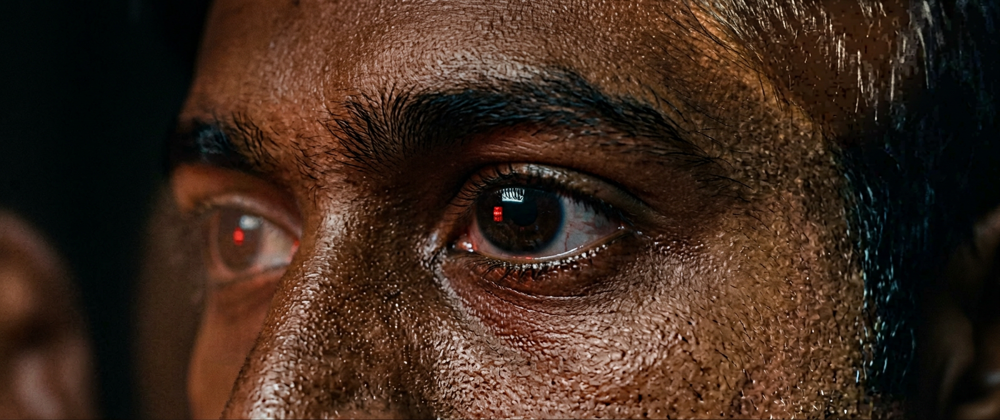
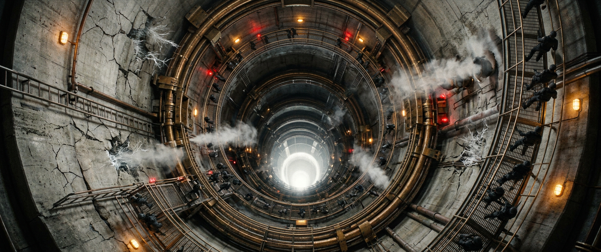
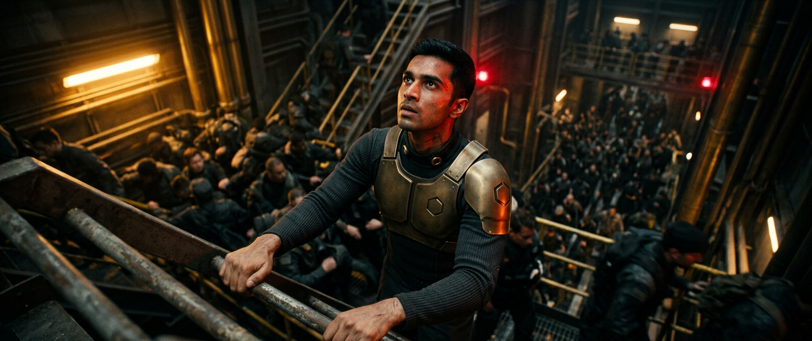
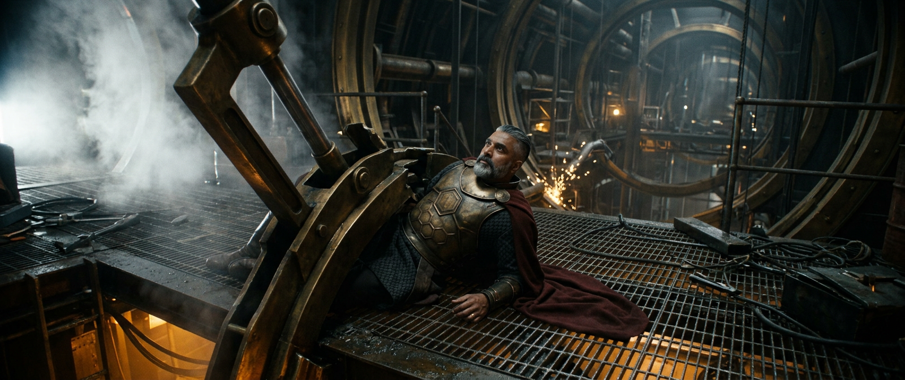
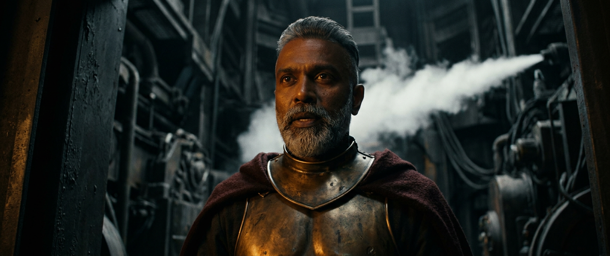
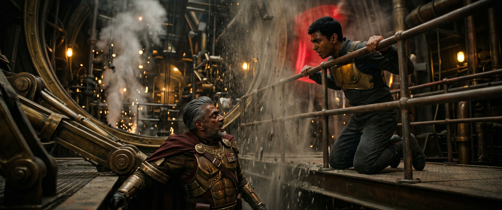
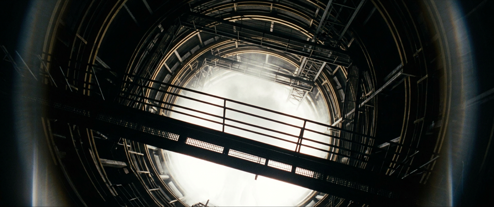
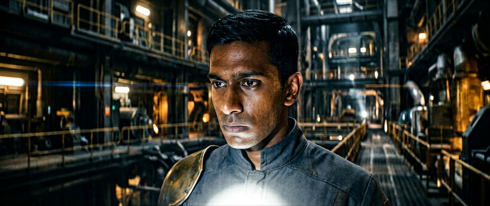
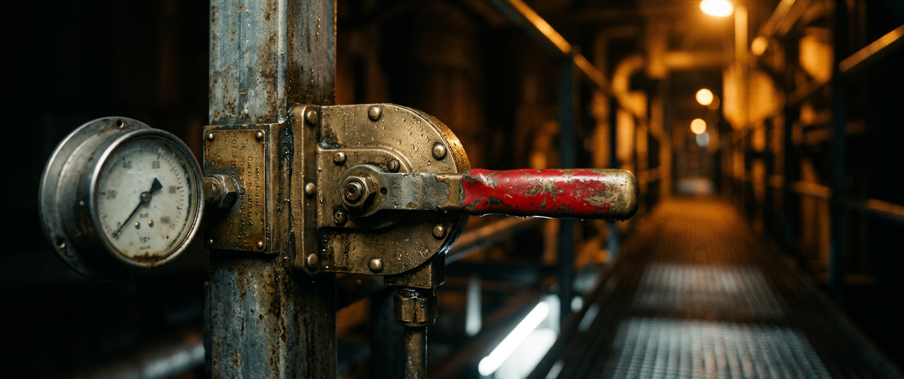
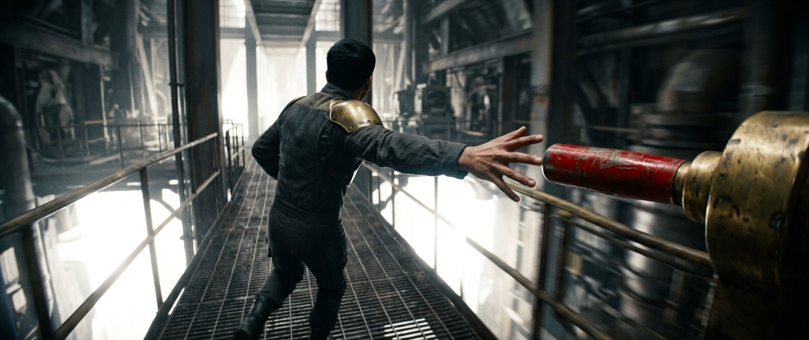

# SCENE 1 — THE SILENCE (PROLOGUE)
## Shooting board · keyframe plates

**INT. CRADLE CORE — CONTAINMENT SHAFT** · Act I · `LOC-01` · 14:12, 3 Aug 2059 · interior / emergency state

> **SCENE OBJECTIVE:** Cadet Arjun wants to reach Dev before the cascade completes.
> **OUTCOME:** Withheld — the cut lands 4 frames before his hand reaches the lever.
> **VALUE SHIFT:** Safety (+) → Catastrophe (−).

---

## ⚠️ WHY THIS SCENE IS SHOT FIRST

Scene 1 and Scene 15 are **the same photography**. Shots `1D`, `1E` and `1J` are reused in Scene 15 as `15B`, `15C` and `15D`, passed through a helmet-camera degrade (4:3 crop inside 2.39, −60% saturation, scan lines, exposure pumping, band-limited audio). Only `15D` continues past the Scene 1 cut point.

These plates are therefore the **source of truth for the midpoint of the film**. Any drift between them destroys the reveal, and with it the third act. They are generated, approved and locked before any other shot in the production.

| Scene 1 plate | Reused in Scene 15 as | Treatment |
|---|---|---|
| `S01-1D` | `15B` | identical plate + helmet-cam degrade |
| `S01-1E` | `15C` | identical plate + helmet-cam degrade |
| `S01-1J` | `15D` | identical plate + degrade, then **continues past the cut** |

---

## THE BOARD

### 1A · ECU · 85mm · 5s

| | |
|---|---|
| **Angle** | eye |
| **Movement** | static |
| **Action** | Black frame resolving into a single red alarm gyro reflected in a young man's wet eye; the pupil contracts as the light sweeps past |
| **Lighting** | single rotating red gyro, everything else black |
| **VFX** | none (in-camera) |
| **Sound** | 38Hz sub-bass; distant klaxon; Amara V.O. 'Anchor before you build.' |

### 1B · EWS · 21mm · 7s

| | |
|---|---|
| **Angle** | extreme high, looking straight down the shaft |
| **Movement** | slow crane descent |
| **Action** | Reveal of the 60m brass-ringed containment shaft plunging 200m; sixty Corps personnel evacuating four levels of catwalk; steam venting; crystal filament veining the concrete |
| **Lighting** | amber sodium work lamps, spinning red gyros, a growing white glow from the base |
| **VFX** | full CG shaft extension below level 4; crystal filament growth; volumetric steam |
| **Sound** | klaxons, hydraulics, running boots, hum rising |

### 1C · MS · 32mm · 6s

| | |
|---|---|
| **Angle** | low, handheld |
| **Movement** | tracking backwards ahead of subject |
| **Action** | Cadet Arjun shoulders upstream through the evacuating crowd, hauling himself up a ladder against the flow |
| **Lighting** | amber practicals raking, red gyro strobing across his face |
| **VFX** | atmospheric only |
| **Sound** | crowd, metal, his breathing loud in the mix |

### 1D · WS · 40mm · 5s

| | |
|---|---|
| **Angle** | slightly high, Arjun's POV |
| **Movement** | handheld settle |
| **Action** | Dev pinned beneath a collapsed brass containment arm on the level-3 catwalk, entirely calm, oxblood cloak spread in the steam |
| **Lighting** | amber key from below, white bloom edge-lighting his right side |
| **VFX** | CG containment arm; sparks; the white bloom glow |
| **Sound** | the hum takes over the mix |

### 1E · CU · 75mm · 6s

| | |
|---|---|
| **Angle** | eye, slight low |
| **Movement** | static |
| **Action** | Dev: 'Cadet. Go up.' Perfect calm. A steam vent blows past behind him |
| **Lighting** | amber key, hard shadow, white rim growing |
| **VFX** | steam element |
| **Sound** | dialogue dry and close against the enormous room tone |

### 1F · MS 2-shot · 50mm · 9s

| | |
|---|---|
| **Angle** | eye |
| **Movement** | slow push in |
| **Action** | Arjun kneeling at the rail above Dev; the argument; the shaft lurches and dust falls between them |
| **Lighting** | amber, red gyro passing every 2s |
| **VFX** | debris, dust fall |
| **Sound** | structural groan under dialogue |

### 1G · WS · 25mm · 8s

| | |
|---|---|
| **Angle** | low, looking down the shaft past the catwalk |
| **Movement** | slow tilt down |
| **Action** | The white bloom being born at the base of the shaft — not fire; a soundless, patient, gentle white expansion rising ring by ring |
| **Lighting** | the bloom is the only source; everything silhouettes |
| **VFX** | HERO VFX — the Bloom: a non-turbulent, slow, glassy white expansion, no flame, no smoke, consuming catwalks silently |
| **Sound** | ALL SOUND DUCKS to a single sustained 38Hz tone |

### 1H · CU · 50mm · 5s

| | |
|---|---|
| **Angle** | eye |
| **Movement** | handheld |
| **Action** | Arjun looks at the bloom, at Dev, at the lever. Decision lands on his face |
| **Lighting** | white bloom key from below, amber fill dying |
| **VFX** | interactive white light on skin |
| **Sound** | heartbeat only |

### 1I · insert · 40mm macro · 3s

| | |
|---|---|
| **Angle** | eye, level with the lever |
| **Movement** | whip-focus rack |
| **Action** | The brass containment ring lever, red-painted grip, chest height, 40m of catwalk away, going out of focus then sharp |
| **Lighting** | amber practical, white spill |
| **VFX** | none |
| **Sound** | a single metallic chime |

### 1J · MS to ECU · 32mm · 6s

| | |
|---|---|
| **Angle** | low behind |
| **Movement** | fast handheld run-in |
| **Action** | Arjun runs the catwalk. The lever fills frame. His hand reaches — CUT TO BLACK 4 frames before contact |
| **Lighting** | blown white, amber gone |
| **VFX** | white bloom overtaking frame edges |
| **Sound** | everything → ABSOLUTE SILENCE for 3s over black |

---

**Scene total:** 10 shots · 60s (~1 min) before the title cards.

After `1J`: **hard cut to black, absolute silence for 3 full seconds**, then the three title cards in white on black, silent:

> *Two hundred thousand people died in four seconds.*  
> *One hundred and thirty-eight Guardians died with them.*  
> *Two walked out.*