# SCENE 15 — NINETY SECONDS (MIDPOINT)
## Shooting board · keyframe plates

**INT. PLAYBACK BOOTH / INT. CRADLE CORE 2059** · Act II-A · `LOC-06 + LOC-01` · 03:55 / 14:12 2059 · —

> **SCENE OBJECTIVE:** Arjun wants to see the ninety seconds; every part of him also wants not to.
> **OUTCOME:** He sees it. The hand on the lever is his own.
> **VALUE SHIFT:** Grief (−) → Guilt (−−). The film turns here.

---

## ⚠️ THE FRAME-MATCH CONTRACT

`15B`, `15C` and `15D` are **not new photography**. They are the Scene 1 plates run through the helmet-camera degrade — 4:3 image pillarboxed inside the 2.39 frame, −60% saturation, scan lines, exposure pumping, band-limited audio. If a single element drifts, the midpoint reveal dies.

| Scene 15 plate | Source | Treatment |
|---|---|---|
| `15B` | `boards/scene-01/S01-1D.png` | degrade only — frame-for-frame identical |
| `15C` | `boards/scene-01/S01-1E.png` | degrade only — frame-for-frame identical |
| `15D` | `boards/scene-01/S01-1J.png` | degrade, then **continues past the Scene 1 cut point**: the hand closes, the lever hauls, the containment ring retracts |

The degrade is deterministic, not a re-render. Reproduce it from the repo root of this package with:

```bash
tools/helmet-cam-degrade.sh boards/scene-01/S01-1D.png boards/scene-15/S15-15B.png
tools/helmet-cam-degrade.sh boards/scene-01/S01-1E.png boards/scene-15/S15-15C.png
```

---

## THE BOARD

### 15A · MS · 40mm · 8s

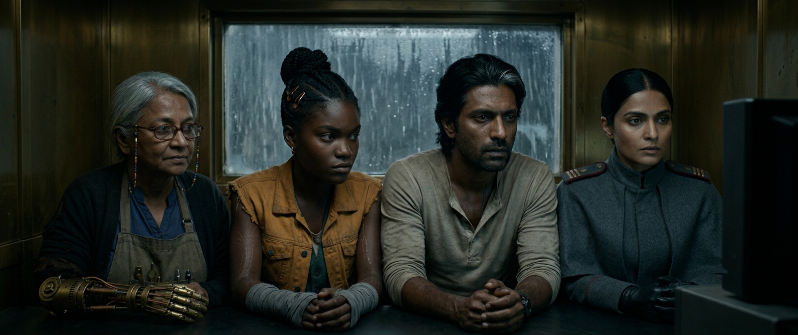

| | |
|---|---|
| **Angle** | eye, four faces in a row |
| **Movement** | static |
| **Action** | A cramped brass playback booth; four faces lit only by a small 4:3 screen inside our 2.39 frame — the aspect ratio itself is a jail |
| **Lighting** | screen light only, flickering |
| **VFX** | screen comp |
| **Sound** | cartridge mechanism; tape hiss |

### 15B · REPLAY of 1D · 40mm · 6s  ·  ⛓ inherited from `S01-1D`

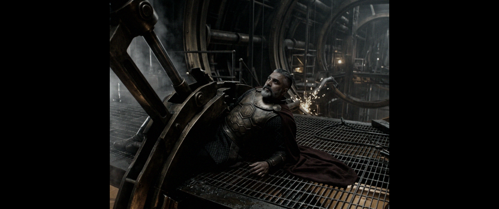

| | |
|---|---|
| **Angle** | IDENTICAL to shot 1D |
| **Movement** | IDENTICAL |
| **Action** | FRAME-FOR-FRAME MATCH: Dev pinned on the level-3 catwalk. Now degraded to helmet-cam quality: 4:3, 60% desaturated, scan lines, exposure pumping |
| **Lighting** | identical to 1D, then processed through the helmet-cam LUT |
| **VFX** | helmet-cam degrade pass over the original Sc.1 plates — CONTINUITY CRITICAL |
| **Sound** | tinny, band-limited 300Hz-4kHz |

### 15C · REPLAY of 1E · 75mm · 5s  ·  ⛓ inherited from `S01-1E`

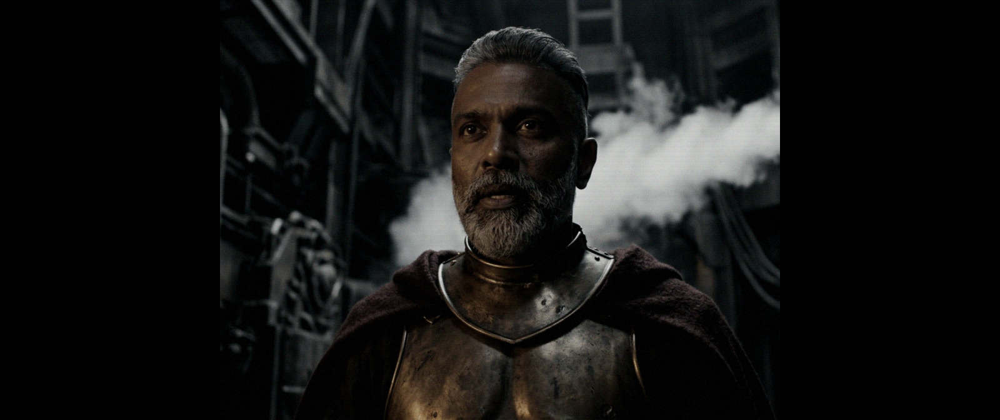

| | |
|---|---|
| **Angle** | IDENTICAL to 1E |
| **Movement** | IDENTICAL |
| **Action** | 'Cadet. Go up.' Same performance, same frame, degraded |
| **Lighting** | identical |
| **VFX** | degrade pass |
| **Sound** | tinny |

### 15D · REPLAY of 1J → CONTINUATION · 32mm · 8s  ·  ⛓ inherited from `S01-1J`

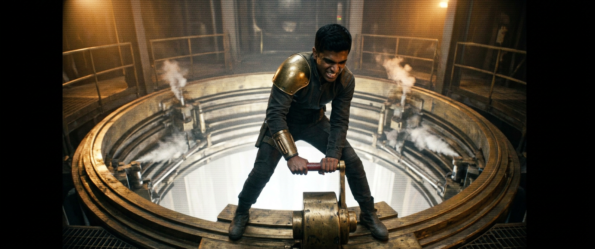

| | |
|---|---|
| **Angle** | IDENTICAL, then NEW |
| **Movement** | identical run-in, then the camera KEEPS GOING |
| **Action** | THE CUT WE DIDN'T GET: Arjun's hand closes on the brass lever with the red grip and HAULS. The containment ring retracts. Dev is freed. For one second it works |
| **Lighting** | amber, white bloom rising |
| **VFX** | HERO VFX — containment ring retraction; the geometry that kills 200,000 people, rendered as a piece of ordinary industrial machinery working correctly |
| **Sound** | hydraulics releasing — a satisfying, awful, mechanical success |

### 15E · CU · 75mm · 6s

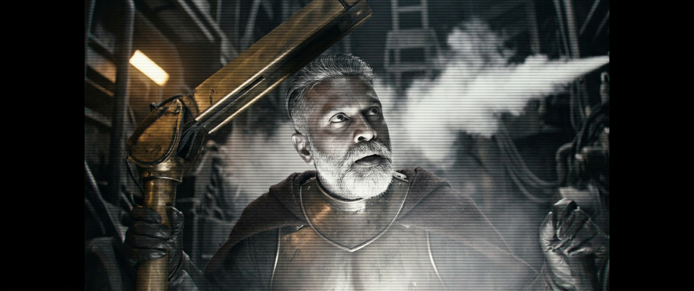

| | |
|---|---|
| **Angle** | eye, on the footage |
| **Movement** | handheld |
| **Action** | Dev pulls himself free, looks up at the boy with pride and horror: 'Oh, Arjun. What have you done.' |
| **Lighting** | white bloom now keying him |
| **VFX** | bloom interactive |
| **Sound** | his voice tiny and tinny and clear |

### 15F · WS · 21mm · 7s

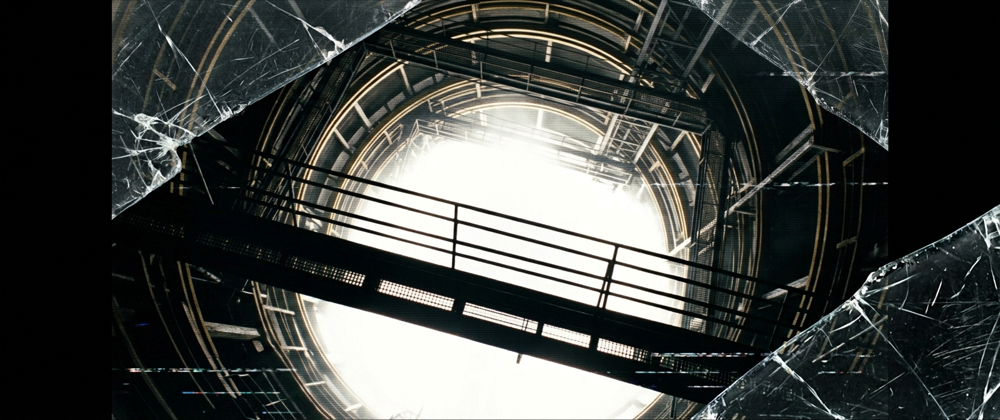

| | |
|---|---|
| **Angle** | helmet POV, low |
| **Movement** | the wearer's own stagger |
| **Action** | The bloom comes up the shaft. Not fire. Silent, white, gentle. It takes the catwalks. It takes Dev |
| **Lighting** | the bloom is total; everything else is gone |
| **VFX** | HERO VFX — the Bloom consuming a 200m shaft; matter does not burn, it goes WHITE and stops |
| **Sound** | the recording's audio CLIPS AND DIES, leaving only the 38Hz tone |

### 15G · ECU · 100mm macro · 5s

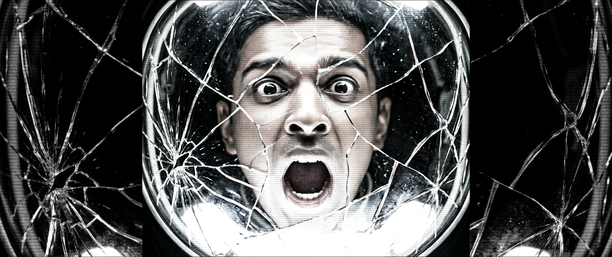

| | |
|---|---|
| **Angle** | reflection in the shattered visor |
| **Movement** | static |
| **Action** | The last thing recorded: the boy's own reflection in his shattered visor, mouth open, lit white |
| **Lighting** | pure white |
| **VFX** | reflection comp in cracked glass |
| **Sound** | nothing |

### 15H · WS · 40mm · 13s

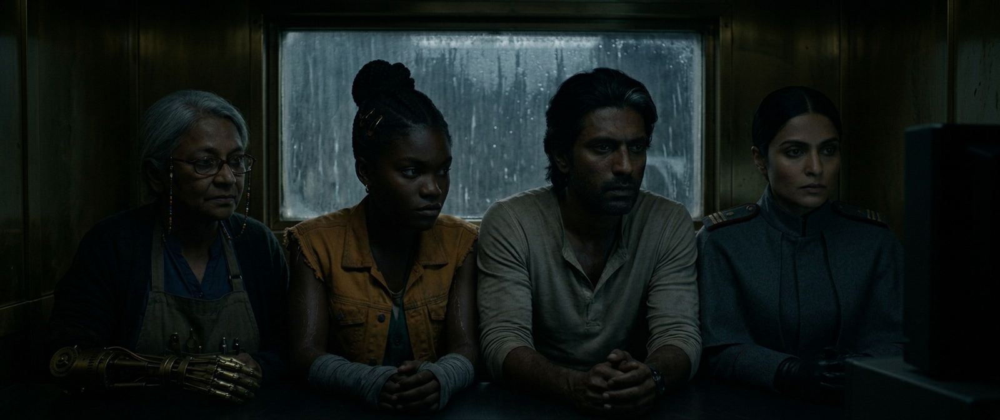

| | |
|---|---|
| **Angle** | eye |
| **Movement** | static, held eleven seconds |
| **Action** | Back in the booth. The little screen holds white, then black. NOBODY MOVES FOR ELEVEN SECONDS |
| **Lighting** | the white screen fading to black takes the only light out of the room with it |
| **VFX** | none |
| **Sound** | tape run-out flapping |

### 15I · insert · 40mm macro · 8s

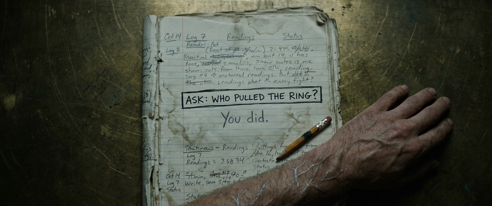

| | |
|---|---|
| **Angle** | directly overhead |
| **Movement** | static |
| **Action** | He opens the notebook to the boxed sentence ASK: WHO PULLED THE RING? and writes beneath it, in pencil: You did. |
| **Lighting** | screen backwash only, very dim |
| **VFX** | none |
| **Sound** | pencil on wet paper |

### 15J · CU · 85mm · 18s

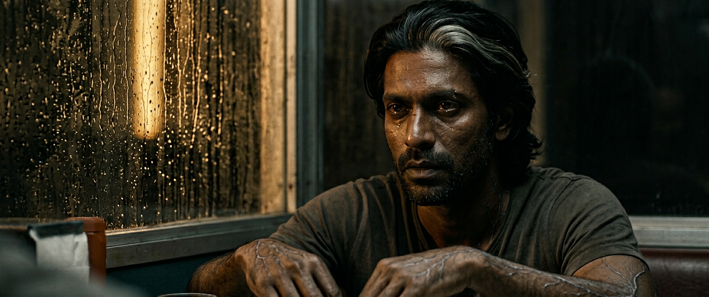

| | |
|---|---|
| **Angle** | eye |
| **Movement** | static |
| **Action** | 'Two hundred thousand people, one hundred and thirty-eight Guardians, and my sister was in the Anjari market buying thread.' Perfectly level, which is worse |
| **Lighting** | a single amber rack light through the booth glass |
| **VFX** | none |
| **Sound** | no score. None |

### 15K · FLASHBACK WS · 50mm · 5s

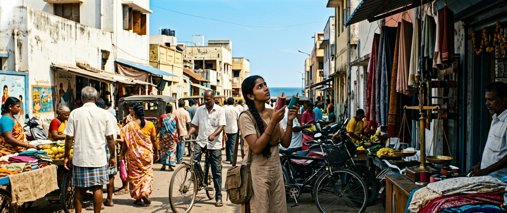

| | |
|---|---|
| **Angle** | eye, locked, no sound |
| **Movement** | static |
| **Action** | ANJARI MARKET, 14:12, 2059 — four seconds, silent: a girl of fifteen, long plait, school satchel, choosing thread at a stall. She looks up at a white light with mild curiosity |
| **Lighting** | warm real afternoon sun — colour floods in for four seconds |
| **VFX** | period set extension; the bloom's first white edge |
| **Sound** | ABSOLUTE SILENCE |

### 15L · MS · 50mm · 11s

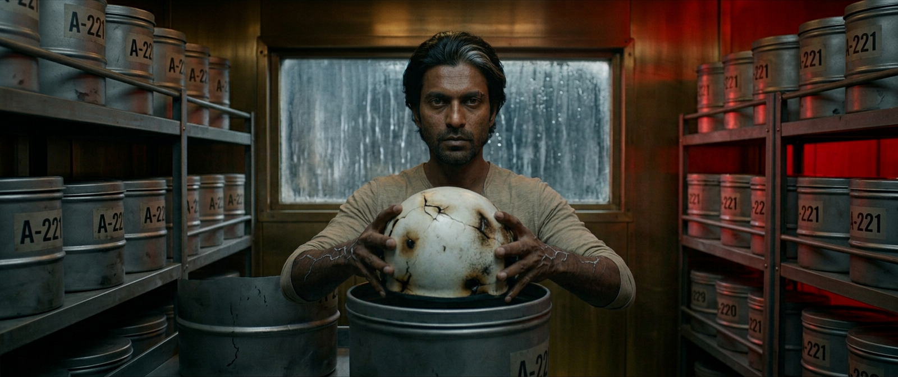

| | |
|---|---|
| **Angle** | eye |
| **Movement** | static |
| **Action** | He puts the helmet back in the drum, closes it, and squares it on the rack — neat, like a man tidying his own grave. 'Don't learn anything from this.' |
| **Lighting** | amber going red as the alarm state changes |
| **VFX** | none |
| **Sound** | Ose on the PA, calm |

---

## Continuity guards for this scene

- **2059 footage:** Cadet Arjun has **no** grey streak and is clean-shaven; Dev has **no** crystallisation, both eyes brown, wedding band **on his hand**.
- **2071 booth:** the streak is on Arjun’s **RIGHT** temple; Kira is six cornrows in a high knot with **three copper clips on the LEFT** and one brass earring; Meera’s prosthetic is her **LEFT** arm.
- **15K** must be the same market, the same light and the same day as `reference/key-art-04-anjari-1411.png` — the shot recurs as 22G and 28L and all three must match exactly.
- The Bloom never burns: no fire, no smoke, no debris, no shockwave, in any plate.
- **15H** holds eleven seconds with nobody moving. The plate is a lighting state, not an action.

[← all boards](../README.md) · [Scene 1 board](../scene-01/README.md) · [prompt sheet](../../prompts-scene/scene-15.md)
